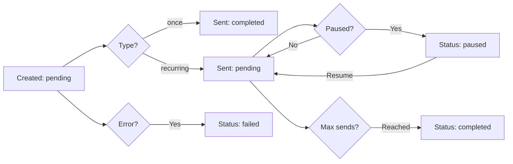

The Admin Scheduled Messages panel provides comprehensive oversight of all scheduled messages across your platform, allowing you to monitor, pause, resume, and delete scheduled messages for any user.

## Overview

<Note>
  This is a **global view** of all scheduled messages. Regular users only see their own scheduled messages, but admins can view and manage messages from all users.
</Note>

Access the admin scheduled messages panel at `/admin/scheduled-messages`.

## Key Statistics

The dashboard displays real-time statistics for all scheduled messages:

<CardGroup cols={4}>
  <Card title="Active" icon="play" color="#10b981">
    Messages with status `pending` - ready to be sent
  </Card>
  
  <Card title="Paused" icon="pause" color="#f59e0b">
    Recurring messages that have been paused
  </Card>
  
  <Card title="Completed" icon="check" color="#6366f1">
    Successfully sent messages (one-time or finished recurring)
  </Card>
  
  <Card title="Failed" icon="xmark" color="#ef4444">
    Messages that failed to send due to errors
  </Card>
</CardGroup>

### Statistics Query

From `AdminScheduledMessageController.php:51-57`:

```php
$stats = [
    'active' => ScheduledMessage::where('status', 'pending')->count(),
    'paused' => ScheduledMessage::where('status', 'paused')->count(),
    'completed' => ScheduledMessage::where('status', 'completed')->count(),
    'failed' => ScheduledMessage::where('status', 'failed')->count(),
];
```

## Advanced Filtering

The admin panel provides powerful filtering options to find specific messages:

### Filter by User

View messages from a specific user:

```php
// From AdminScheduledMessageController.php:21-23
if ($request->filled('user_id') && $request->user_id !== 'all') {
    $query->where('user_id', $request->user_id);
}
```

### Filter by Status

Filter by message status:
- `pending` - Active, waiting to be sent
- `paused` - Temporarily paused (recurring only)
- `completed` - Successfully sent
- `failed` - Failed to send
- `processing` - Currently being sent

```php
// From AdminScheduledMessageController.php:26-28
if ($request->filled('status') && $request->status !== 'all') {
    $query->where('status', $request->status);
}
```

### Filter by Type

Filter by schedule type:
- `once` - One-time scheduled message
- `recurring` - Repeating message (daily, weekly, monthly)

```php
// From AdminScheduledMessageController.php:31-33
if ($request->filled('type') && $request->type !== 'all') {
    $query->where('schedule_type', $request->type);
}
```

### Filter by Webhook

View messages for a specific webhook:

```php
// From AdminScheduledMessageController.php:36-38
if ($request->filled('webhook_id') && $request->webhook_id !== 'all') {
    $query->where('webhook_id', $request->webhook_id);
}
```

### Filter by Date Range

Filter messages by their next send date:

```php
// From AdminScheduledMessageController.php:41-47
if ($request->filled('date_from')) {
    $query->where('next_send_at', '>=', $request->date_from);
}

if ($request->filled('date_to')) {
    $query->where('next_send_at', '<=', $request->date_to);
}
```

<Note>
  All filters can be combined for precise searches. For example, find all paused recurring messages from a specific user for a particular webhook.
</Note>

## Message Details

Each scheduled message displays:

- **User**: Who created the message
- **Webhook**: Target webhook (with name and avatar)
- **Status**: Current message status
- **Type**: `once` or `recurring`
- **Next Send**: When the message will be sent next
- **Send Count**: How many times the message has been sent
- **Content Preview**: Message and embed preview

### Viewing Full Details

Click on a message to view complete details at `/admin/scheduled-messages/{id}`:

```php
// From AdminScheduledMessageController.php:81-88
public function show(ScheduledMessage $scheduled)
{
    $scheduled->load(['user', 'webhook', 'template', 'files']);

    return Inertia::render('admin/scheduled-messages/show', [
        'message' => $scheduled,
    ]);
}
```

The detail view includes:
- Complete message content
- All embed configurations
- Attached files (if any)
- Recurrence pattern (for recurring messages)
- Send history
- Error messages (if failed)

## Managing Messages

<Warning>
  **Powerful Actions**: Admin actions affect user messages immediately. Use with caution and communicate with users when making changes to their scheduled messages.
</Warning>

### Pausing Messages

Pause active recurring messages to temporarily stop them:

<Steps>
  <Step title="Check Status">
    Message must be `pending` and of type `recurring`
  </Step>
  
  <Step title="Pause Action">
    POST to `/admin/scheduled-messages/{id}/pause`
  </Step>
  
  <Step title="Status Update">
    Message status changes to `paused`
  </Step>
</Steps>

```php
// From AdminScheduledMessageController.php:90-98
public function pause(ScheduledMessage $scheduled)
{
    if ($scheduled->schedule_type === 'recurring' && 
        $scheduled->status === 'pending') {
        $scheduled->update(['status' => 'paused']);
        return back()->with('success', 'Message paused successfully!');
    }

    return back()->withErrors(['error' => 'Cannot pause this message']);
}
```

<Note>
  **One-time messages cannot be paused** - they're either pending or completed. Only recurring messages can be paused and resumed.
</Note>

### Resuming Messages

Resume paused messages to continue their schedule:

<Steps>
  <Step title="Check Status">
    Message must have status `paused`
  </Step>
  
  <Step title="Calculate Next Send">
    System calculates the next send time based on recurrence pattern
  </Step>
  
  <Step title="Resume Action">
    POST to `/admin/scheduled-messages/{id}/resume`
  </Step>
  
  <Step title="Status Update">
    Message status changes to `pending` with new `next_send_at`
  </Step>
</Steps>

```php
// From AdminScheduledMessageController.php:100-112
public function resume(ScheduledMessage $scheduled)
{
    if ($scheduled->status === 'paused') {
        $nextSendTime = $scheduled->calculateNextSendTime();
        $scheduled->update([
            'status' => 'pending',
            'next_send_at' => $nextSendTime,
        ]);
        return back()->with('success', 'Message resumed successfully!');
    }

    return back()->withErrors(['error' => 'Cannot resume this message']);
}
```

### Deleting Messages

<Warning>
  **Permanent Action**: Deleting a scheduled message is irreversible and will remove all associated files and data.
</Warning>

Delete scheduled messages permanently:

<Steps>
  <Step title="Select Message">
    Choose the message to delete from the list
  </Step>
  
  <Step title="Confirm Deletion">
    Confirm the action (UI should show confirmation dialog)
  </Step>
  
  <Step title="Delete Files">
    Associated files are removed from storage
  </Step>
  
  <Step title="Delete Message">
    Message record is removed from database
  </Step>
</Steps>

```php
// From AdminScheduledMessageController.php:114-125
public function destroy(ScheduledMessage $scheduled)
{
    // Delete files associated with the message
    foreach ($scheduled->files as $file) {
        $file->delete();
    }

    $scheduled->delete();

    return redirect()->route('admin.scheduled.index')
        ->with('success', 'Scheduled message deleted successfully!');
}
```

## Understanding Message States

Scheduled messages go through different states in their lifecycle:

### State Flow Diagram



### Status Definitions

From `ScheduledMessage.php`:

- **pending**: Active, waiting for next send time
- **processing**: Currently being sent by the queue worker
- **completed**: Finished (one-time sent, or recurring reached max)
- **failed**: Error occurred during sending
- **paused**: Temporarily stopped (recurring only)

## Recurrence Patterns

Recurring messages support three frequencies:

<CardGroup cols={3}>
  <Card title="Daily" icon="calendar-day">
    Sent every day at specified time
    
    ```json
    {
      "frequency": "daily",
      "time": "09:00"
    }
    ```
  </Card>
  
  <Card title="Weekly" icon="calendar-week">
    Sent on specific days of the week
    
    ```json
    {
      "frequency": "weekly",
      "time": "09:00",
      "days": [1, 3, 5]
    }
    ```
  </Card>
  
  <Card title="Monthly" icon="calendar">
    Sent on specific day of month
    
    ```json
    {
      "frequency": "monthly",
      "time": "09:00",
      "day": 15
    }
    ```
  </Card>
</CardGroup>

### Next Send Calculation

The system automatically calculates the next send time from `ScheduledMessage.php:87-143`:

```php
public function calculateNextSendTime(): ?Carbon
{
    if ($this->schedule_type === 'once') {
        return null;
    }

    $pattern = $this->recurrence_pattern;
    $timezone = $this->timezone ?? 'UTC';
    $now = Carbon::now($timezone);

    // Calculate based on frequency (daily, weekly, monthly)
    // Returns next send time in UTC
}
```

<Note>
  **Timezone Support**: Each scheduled message can have its own timezone. The system handles timezone conversions automatically, storing all times in UTC internally.
</Note>

## File Attachments

Scheduled messages can include file attachments:

- Stored in `storage/app/scheduled_messages/`
- Maximum 10MB per file
- Automatically deleted after sending (one-time) or when message is deleted
- Related through `scheduled_message_files` table

### File Lifecycle

<Steps>
  <Step title="Upload">
    User uploads file when creating scheduled message
  </Step>
  
  <Step title="Storage">
    File saved to `storage/app/scheduled_messages/{id}/`
  </Step>
  
  <Step title="Sending">
    File attached to Discord webhook as multipart upload
  </Step>
  
  <Step title="Cleanup">
    File deleted after successful send (one-time) or manual deletion
  </Step>
</Steps>

## Monitoring and Troubleshooting

### Common Issues

<AccordionGroup>
  <Accordion title="Message stuck in 'processing'">
    The queue worker may have crashed or been stopped. Check:
    - Queue worker status: `php artisan queue:work`
    - Failed jobs table: `php artisan queue:failed`
    - System logs for errors
  </Accordion>
  
  <Accordion title="Messages not sending at correct time">
    Verify:
    - Cron job is running: `* * * * * php artisan schedule:run`
    - Server timezone configuration
    - Message timezone setting
  </Accordion>
  
  <Accordion title="Failed messages with webhook errors">
    Common causes:
    - Invalid webhook URL (deleted or changed)
    - Discord API rate limits
    - Message exceeds Discord limits (content too long, too many embeds)
    - File attachment too large
  </Accordion>
</AccordionGroup>

### Error Messages

When messages fail, the error is stored in the `error_message` field:

```php
// From ScheduledMessage.php:171-177
public function markAsFailed(string $error): void
{
    $this->update([
        'status' => 'failed',
        'error_message' => $error,
    ]);
}
```

View error details in the message detail page.

## API Routes Reference

All admin scheduled message routes from `web.php:180-189`:

```php
// List all scheduled messages with filters
GET /admin/scheduled-messages

// View single message details
GET /admin/scheduled-messages/{id}

// Pause a recurring message
POST /admin/scheduled-messages/{id}/pause

// Resume a paused message
POST /admin/scheduled-messages/{id}/resume

// Delete a scheduled message
DELETE /admin/scheduled-messages/{id}
```

<Warning>
  All routes require admin authentication and password confirmation.
</Warning>

## Best Practices

<Steps>
  <Step title="Regular Monitoring">
    Check the dashboard regularly for failed messages and high failure rates
  </Step>
  
  <Step title="Communicate Changes">
    Inform users before pausing or deleting their scheduled messages
  </Step>
  
  <Step title="Review Failed Messages">
    Investigate patterns in failed messages to identify system issues
  </Step>
  
  <Step title="Monitor Storage">
    Keep an eye on file attachment storage usage
  </Step>
</Steps>

## Related Documentation

<CardGroup cols={3}>
  <Card title="User Scheduled Messages" icon="clock" href="/essentials/scheduled-messages">
    User-facing scheduled messages documentation
  </Card>
  
  <Card title="Dashboard" icon="gauge-high" href="/admin/dashboard">
    Return to admin dashboard
  </Card>
  
  <Card title="User Management" icon="users-gear" href="/admin/user-management">
    Manage user accounts and permissions
  </Card>
</CardGroup>