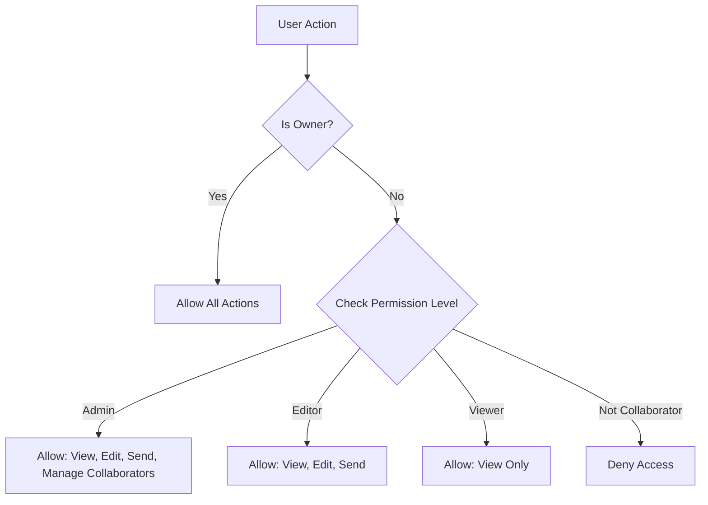

## Overview

The Discord Webhook Manager implements a granular role-based permission system that allows webhook owners to control what collaborators can do. There are three distinct permission levels, each with specific capabilities.

<Note>
  The webhook owner always has full control and is not affected by permission levels. Permission levels only apply to collaborators.
</Note>

## Permission Levels

### For Webhooks

Webhooks support three permission levels defined in the database schema:

```php
// 2025_12_16_165826_create_webhook_collaborators_table.php:18
$table->enum('permission_level', ['admin', 'editor', 'viewer'])->default('viewer');
```

<CardGroup cols={3}>
  <Card title="Admin" icon="crown" color="#ca8a04">
    Full management capabilities including inviting others and modifying settings.
  </Card>
  
  <Card title="Editor" icon="pen-to-square" color="#2563eb">
    Can edit webhook configuration and send messages but cannot manage collaborators.
  </Card>
  
  <Card title="Viewer" icon="eye" color="#16a34a">
    Read-only access to view webhook details and message history.
  </Card>
</CardGroup>

### For Templates

Templates use a simplified two-level permission system:

```php
// 2025_12_18_184237_create_template_collaborators_table.php:18
$table->enum('permission_level', ['view', 'edit'])->default('view');
```

<CardGroup cols={2}>
  <Card title="Edit" icon="pen-to-square" color="#2563eb">
    Can modify template content and configuration.
  </Card>
  
  <Card title="View" icon="eye" color="#16a34a">
    Read-only access to view and use templates.
  </Card>
</CardGroup>

## Detailed Permission Matrix

### Webhook Permissions

| Action | Owner | Admin | Editor | Viewer |
|--------|-------|-------|--------|--------|
| View webhook details | ✅ | ✅ | ✅ | ✅ |
| View message history | ✅ | ✅ | ✅ | ✅ |
| Send messages | ✅ | ✅ | ✅ | ❌ |
| Edit webhook settings | ✅ | ✅ | ✅ | ❌ |
| Delete webhook | ✅ | ❌ | ❌ | ❌ |
| Invite collaborators | ✅ | ✅ | ❌ | ❌ |
| Remove collaborators | ✅ | ✅ | ❌ | ❌ |
| Change permissions | ✅ | ✅ | ❌ | ❌ |
| Leave webhook | ❌ | ✅ | ✅ | ✅ |

<Warning>
  The webhook owner cannot leave their own webhook. If you want to transfer ownership, you must delete the webhook or implement a transfer feature.
</Warning>

### Template Permissions

| Action | Owner | Edit | View |
|--------|-------|------|------|
| View template | ✅ | ✅ | ✅ |
| Use template | ✅ | ✅ | ✅ |
| Edit template | ✅ | ✅ | ❌ |
| Delete template | ✅ | ❌ | ❌ |
| Share template | ✅ | ❌ | ❌ |

## Authorization Implementation

### Managing Collaborators

The system uses Laravel's authorization policies to check permissions:

```php
// CollaboratorController.php:24
$this->authorize('manageCollaborators', $webhook);
```

This authorization check ensures that only webhook owners and admins can:
- View the collaborators list
- Send invitations
- Update permission levels
- Remove collaborators

### Viewing Collaborators

When viewing collaborators, the system loads all relevant relationships:

```php
// CollaboratorController.php:26-38
$collaborators = $webhook->collaborators()
    ->with('user:id,name,email')
    ->get();

$pendingInvitations = $webhook->invitations()
    ->where('status', 'pending')
    ->where('expires_at', '>', now())
    ->get();
```

This provides a complete view of both active collaborators and pending invitations.

### Updating Permission Levels

Admins and owners can change a collaborator's permission level:

```php
// CollaboratorController.php:113-128
public function update(Request $request, Webhook $webhook, WebhookCollaborator $collaborator)
{
    $this->authorize('manageCollaborators', $webhook);
    
    // Ensure the collaborator belongs to this webhook
    if ($collaborator->webhook_id !== $webhook->id) {
        abort(404);
    }
    
    $validated = $request->validate([
        'permission_level' => 'required|in:admin,editor,viewer',
    ]);
    
    $collaborator->update($validated);
    
    return back()->with('success', 'Permission level updated successfully!');
}
```

<Note>
  The system validates that the collaborator belongs to the webhook before updating to prevent unauthorized permission changes.
</Note>

## Leaving Webhooks

Collaborators (but not owners) can voluntarily leave a webhook:

```php
// CollaboratorController.php:152-174
public function leave(Webhook $webhook)
{
    $user = auth()->user();
    
    // Check if user is a collaborator
    $collaborator = $webhook->collaborators()
        ->where('user_id', $user->id)
        ->first();
    
    if (!$collaborator) {
        return back()->withErrors(['error' => 'You are not a collaborator of this webhook.']);
    }
    
    // Prevent owner from leaving
    if ($webhook->user_id === $user->id) {
        return back()->withErrors(['error' => 'Webhook owner cannot leave.']);
    }
    
    $collaborator->delete();
    
    return redirect()->route('webhooks.index')
        ->with('success', 'You have left the webhook successfully!');
}
```

<Steps>
  <Step title="Verify Membership">
    The system checks if the user is actually a collaborator on the webhook.
  </Step>
  
  <Step title="Prevent Owner Exit">
    Webhook owners are prevented from leaving their own webhooks.
  </Step>
  
  <Step title="Remove Collaboration">
    The collaborator record is deleted, immediately revoking all access.
  </Step>
  
  <Step title="Redirect">
    The user is redirected to the webhooks list with a success message.
  </Step>
</Steps>

## Removing Collaborators

Owners and admins can remove collaborators:

```php
// CollaboratorController.php:135-147
public function destroy(Webhook $webhook, WebhookCollaborator $collaborator)
{
    $this->authorize('manageCollaborators', $webhook);
    
    // Ensure the collaborator belongs to this webhook
    if ($collaborator->webhook_id !== $webhook->id) {
        abort(404);
    }
    
    $collaborator->delete();
    
    return back()->with('success', 'Collaborator removed successfully!');
}
```

<Warning>
  Removing a collaborator immediately revokes their access. They will no longer be able to view, edit, or send messages to the webhook.
</Warning>

## Database Schema

### Webhook Collaborators

```sql
-- 2025_12_16_165826_create_webhook_collaborators_table.php
CREATE TABLE webhook_collaborators (
    id BIGINT UNSIGNED PRIMARY KEY,
    webhook_id BIGINT UNSIGNED,
    user_id BIGINT UNSIGNED,
    permission_level ENUM('admin', 'editor', 'viewer') DEFAULT 'viewer',
    invited_by BIGINT UNSIGNED,
    invited_at TIMESTAMP DEFAULT CURRENT_TIMESTAMP,
    accepted_at TIMESTAMP NULL,
    created_at TIMESTAMP,
    updated_at TIMESTAMP,
    
    UNIQUE KEY (webhook_id, user_id),
    FOREIGN KEY (webhook_id) REFERENCES webhooks(id) ON DELETE CASCADE,
    FOREIGN KEY (user_id) REFERENCES users(id) ON DELETE CASCADE,
    FOREIGN KEY (invited_by) REFERENCES users(id) ON DELETE CASCADE,
    INDEX (webhook_id),
    INDEX (user_id)
);
```

### Template Collaborators

```sql
-- 2025_12_18_184237_create_template_collaborators_table.php
CREATE TABLE template_collaborators (
    id BIGINT UNSIGNED PRIMARY KEY,
    template_id BIGINT UNSIGNED,
    user_id BIGINT UNSIGNED,
    permission_level ENUM('view', 'edit') DEFAULT 'view',
    created_at TIMESTAMP,
    updated_at TIMESTAMP,
    
    UNIQUE KEY (template_id, user_id),
    FOREIGN KEY (template_id) REFERENCES templates(id) ON DELETE CASCADE,
    FOREIGN KEY (user_id) REFERENCES users(id) ON DELETE CASCADE
);
```

## Model Relationships

The `WebhookCollaborator` model defines important relationships:

```php
// WebhookCollaborator.php:25-38
public function webhook(): BelongsTo
{
    return $this->belongsTo(Webhook::class);
}

public function user(): BelongsTo
{
    return $this->belongsTo(User::class);
}

public function inviter(): BelongsTo
{
    return $this->belongsTo(User::class, 'invited_by');
}
```

These relationships enable:
- Loading webhook details for collaborators
- Accessing user information for display
- Tracking who invited each collaborator

## Permission Metadata

The system tracks additional metadata for audit purposes:

```php
// WebhookCollaborator.php:10-22
protected $fillable = [
    'webhook_id',
    'user_id',
    'permission_level',
    'invited_by',
    'invited_at',
    'accepted_at',
];

protected $casts = [
    'invited_at' => 'datetime',
    'accepted_at' => 'datetime',
];
```

<Accordion title="invited_by">
  Tracks which user sent the invitation, enabling audit trails and preventing unauthorized invitation cancellation.
</Accordion>

<Accordion title="invited_at">
  Records when the invitation was originally created, useful for security audits.
</Accordion>

<Accordion title="accepted_at">
  Tracks when the invitation was accepted, showing when the user officially became a collaborator.
</Accordion>

## Best Practices

<CardGroup cols={2}>
  <Card title="Principle of Least Privilege" icon="shield">
    Always start with the lowest permission level (Viewer) and upgrade only when necessary.
  </Card>
  
  <Card title="Regular Audits" icon="clipboard-check">
    Periodically review collaborators and their permission levels to ensure they're still appropriate.
  </Card>
  
  <Card title="Admin Sparingly" icon="user-shield">
    Only grant Admin permission to truly trusted team members who need to manage collaborators.
  </Card>
  
  <Card title="Document Roles" icon="book">
    Maintain documentation of who has access and why, especially for Admin permissions.
  </Card>
</CardGroup>

## Security Considerations

<Warning>
  **Cascade Deletions**: When a webhook or user is deleted, all associated collaborator records are automatically deleted due to `ON DELETE CASCADE` constraints.
</Warning>

<Note>
  **Unique Constraint**: The database enforces a unique constraint on `(webhook_id, user_id)`, preventing duplicate collaborator records.
</Note>

### Authorization Flow



## Troubleshooting

<Accordion title="Cannot manage collaborators">
  Only webhook owners and users with Admin permission can manage collaborators. Check your permission level in the webhook settings.
</Accordion>

<Accordion title="Permission changes not taking effect">
  Permission changes are applied immediately. Try refreshing the page or logging out and back in. Check browser cache if issues persist.
</Accordion>

<Accordion title="Cannot leave webhook">
  Only collaborators can leave webhooks. The webhook owner cannot leave their own webhook. If you're the owner and want to leave, you must transfer ownership (if implemented) or delete the webhook.
</Accordion>

<Accordion title="Collaborator removed themselves">
  Collaborators can voluntarily leave at any time using the "Leave Webhook" button. This is by design to give users control over their collaborations.
</Accordion>

## Next Steps

<CardGroup cols={2}>
  <Card title="Team Invitations" icon="envelope" href="/collaboration/team-invitations">
    Learn how to send and manage webhook invitations
  </Card>
  
  <Card title="Sharing" icon="share-nodes" href="/collaboration/sharing">
    Best practices for sharing webhooks and templates with teams
  </Card>
</CardGroup>