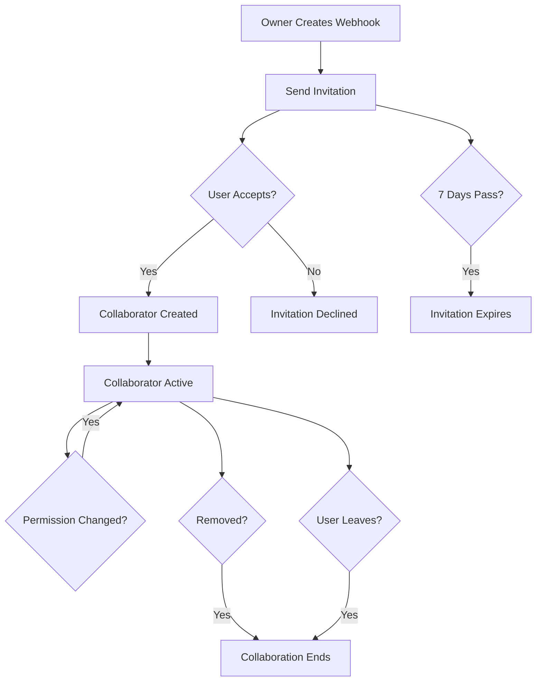

## Overview

The Discord Webhook Manager provides robust sharing capabilities for both webhooks and templates, enabling teams to collaborate effectively. This guide covers best practices, workflows, and technical implementation details.

<Note>
  Sharing is only available for registered users. Both the sharer and recipient must have accounts in the system.
</Note>

## Sharing Webhooks

Webhooks can be shared with multiple collaborators, each with their own permission level. The sharing process is invitation-based for security and control.

### Webhook Sharing Workflow

<Steps>
  <Step title="Navigate to Webhook">
    Open the webhook you want to share. Only owners and admins can access the collaboration settings.
  </Step>
  
  <Step title="Access Collaborators">
    Click on the "Collaborators" or "Share" button to open the collaboration management interface.
    
    ```php
    // CollaboratorController.php:22-40
    public function index(Webhook $webhook)
    {
        $this->authorize('manageCollaborators', $webhook);
        
        $collaborators = $webhook->collaborators()
            ->with('user:id,name,email')
            ->get();
        
        $pendingInvitations = $webhook->invitations()
            ->where('status', 'pending')
            ->where('expires_at', '>', now())
            ->get();
        
        return Inertia::render('webhooks/collaborators', [
            'webhook' => $webhook->load('owner:id,name,email'),
            'collaborators' => $collaborators,
            'pendingInvitations' => $pendingInvitations,
        ]);
    }
    ```
  </Step>
  
  <Step title="Send Invitation">
    Enter the collaborator's email address and select their permission level (Admin, Editor, or Viewer).
    
    <Warning>
      The email must be associated with an existing account. Users who haven't registered cannot be invited.
    </Warning>
  </Step>
  
  <Step title="Invitation Sent">
    The system sends an email notification with a secure invitation link. The invitation expires in 7 days.
  </Step>
  
  <Step title="Collaborator Accepts">
    The invited user clicks the link in their email and accepts the invitation. They immediately gain access based on their assigned permission level.
  </Step>
</Steps>

### Who Can Share Webhooks?

Only users with management privileges can share webhooks:

<CardGroup cols={2}>
  <Card title="Webhook Owner" icon="crown" color="#ca8a04">
    The creator of the webhook has full sharing rights and can invite unlimited collaborators.
  </Card>
  
  <Card title="Admin Collaborators" icon="user-shield" color="#2563eb">
    Users with Admin permission can also send invitations and manage other collaborators.
  </Card>
</CardGroup>

```php
// CollaboratorController.php:45-47
public function store(Request $request, Webhook $webhook)
{
    $this->authorize('manageCollaborators', $webhook);
    // ... invitation creation logic
}
```

## Sharing Templates

Templates use a similar but simplified sharing system with only two permission levels: Edit and View.

### Template Permission Levels

<CardGroup cols={2}>
  <Card title="Edit" icon="pen-to-square" color="#2563eb">
    Collaborators can modify template content, change settings, and use the template in messages.
  </Card>
  
  <Card title="View" icon="eye" color="#16a34a">
    Collaborators can view template details and use the template but cannot modify it.
  </Card>
</CardGroup>

The database schema for template sharing:

```sql
-- 2025_12_18_184237_create_template_collaborators_table.php
CREATE TABLE template_collaborators (
    id BIGINT UNSIGNED PRIMARY KEY,
    template_id BIGINT UNSIGNED,
    user_id BIGINT UNSIGNED,
    permission_level ENUM('view', 'edit') DEFAULT 'view',
    created_at TIMESTAMP,
    updated_at TIMESTAMP,
    
    UNIQUE KEY (template_id, user_id),
    FOREIGN KEY (template_id) REFERENCES templates(id) ON DELETE CASCADE,
    FOREIGN KEY (user_id) REFERENCES users(id) ON DELETE CASCADE
);
```

<Note>
  The unique constraint on `(template_id, user_id)` prevents duplicate collaborations and ensures each user has only one permission level per template.
</Note>

## Collaboration Models

### Webhook Collaboration Data

The `WebhookCollaborator` model tracks all collaboration details:

```php
// WebhookCollaborator.php:10-22
protected $fillable = [
    'webhook_id',
    'user_id',
    'permission_level',
    'invited_by',
    'invited_at',
    'accepted_at',
];

protected $casts = [
    'invited_at' => 'datetime',
    'accepted_at' => 'datetime',
];
```

<Accordion title="Relationship to Webhook">
  ```php
  // WebhookCollaborator.php:25-28
  public function webhook(): BelongsTo
  {
      return $this->belongsTo(Webhook::class);
  }
  ```
  Enables easy access to webhook details from a collaborator record.
</Accordion>

<Accordion title="Relationship to User">
  ```php
  // WebhookCollaborator.php:30-33
  public function user(): BelongsTo
  {
      return $this->belongsTo(User::class);
  }
  ```
  Links the collaborator to their user account for profile information.
</Accordion>

<Accordion title="Relationship to Inviter">
  ```php
  // WebhookCollaborator.php:35-38
  public function inviter(): BelongsTo
  {
      return $this->belongsTo(User::class, 'invited_by');
  }
  ```
  Tracks who sent the original invitation for audit purposes.
</Accordion>

## Managing Shared Resources

### Viewing Collaborators

Both webhook owners and admins can view the complete list of collaborators and pending invitations:

```php
// CollaboratorController.php:26-33
$collaborators = $webhook->collaborators()
    ->with('user:id,name,email')
    ->get();

$pendingInvitations = $webhook->invitations()
    ->where('status', 'pending')
    ->where('expires_at', '>', now())
    ->get();
```

This provides:
- Active collaborators with their permission levels
- Pending invitations that haven't been accepted yet
- Expired or cancelled invitations are automatically filtered out

### Changing Permission Levels

Owners and admins can update collaborator permissions at any time:

```php
// CollaboratorController.php:113-128
public function update(Request $request, Webhook $webhook, WebhookCollaborator $collaborator)
{
    $this->authorize('manageCollaborators', $webhook);
    
    if ($collaborator->webhook_id !== $webhook->id) {
        abort(404);
    }
    
    $validated = $request->validate([
        'permission_level' => 'required|in:admin,editor,viewer',
    ]);
    
    $collaborator->update($validated);
    
    return back()->with('success', 'Permission level updated successfully!');
}
```

<Warning>
  Permission changes take effect immediately. The collaborator's next action will be governed by their new permission level.
</Warning>

### Removing Collaborators

There are two ways to end a collaboration:

<Accordion title="Owner/Admin Removal">
  Owners and admins can remove any collaborator:
  
  ```php
  // CollaboratorController.php:135-147
  public function destroy(Webhook $webhook, WebhookCollaborator $collaborator)
  {
      $this->authorize('manageCollaborators', $webhook);
      
      if ($collaborator->webhook_id !== $webhook->id) {
          abort(404);
      }
      
      $collaborator->delete();
      
      return back()->with('success', 'Collaborator removed successfully!');
  }
  ```
  
  This immediately revokes all access.
</Accordion>

<Accordion title="Voluntary Leave">
  Collaborators can leave on their own:
  
  ```php
  // CollaboratorController.php:152-174
  public function leave(Webhook $webhook)
  {
      $user = auth()->user();
      
      $collaborator = $webhook->collaborators()
          ->where('user_id', $user->id)
          ->first();
      
      if (!$collaborator) {
          return back()->withErrors(['error' => 'You are not a collaborator of this webhook.']);
      }
      
      if ($webhook->user_id === $user->id) {
          return back()->withErrors(['error' => 'Webhook owner cannot leave.']);
      }
      
      $collaborator->delete();
      
      return redirect()->route('webhooks.index')
          ->with('success', 'You have left the webhook successfully!');
  }
  ```
  
  <Note>
    The webhook owner cannot leave their own webhook. This prevents orphaned webhooks.
  </Note>
</Accordion>

## Team Collaboration Patterns

### Pattern 1: Hierarchical Teams

<Steps>
  <Step title="Team Lead as Owner">
    The team lead creates the webhook and serves as the owner.
  </Step>
  
  <Step title="Senior Members as Admins">
    Trusted senior team members receive Admin permissions to help manage the webhook and invite others.
  </Step>
  
  <Step title="Active Members as Editors">
    Team members who need to send messages and edit settings get Editor permissions.
  </Step>
  
  <Step title="Stakeholders as Viewers">
    Stakeholders and observers get Viewer permissions to monitor activity without making changes.
  </Step>
</Steps>

### Pattern 2: Project-Based Sharing

<Steps>
  <Step title="Create Project Webhook">
    Create a webhook dedicated to a specific project or channel.
  </Step>
  
  <Step title="Invite Project Team">
    Invite all project members with Editor permissions.
  </Step>
  
  <Step title="Grant Admin to Deputies">
    Give Admin permissions to 1-2 deputy project leads for backup management.
  </Step>
  
  <Step title="Remove When Complete">
    When the project ends, remove collaborators or archive the webhook.
  </Step>
</Steps>

### Pattern 3: Department Templates

<Steps>
  <Step title="Create Department Templates">
    Create standard message templates for common department communications.
  </Step>
  
  <Step title="Share with Edit Permission">
    Share with department heads using Edit permission to maintain templates.
  </Step>
  
  <Step title="Share with View Permission">
    Share with all team members using View permission so they can use but not modify templates.
  </Step>
  
  <Step title="Regular Review">
    Schedule regular reviews to update templates and manage access.
  </Step>
</Steps>

## Security Best Practices

<CardGroup cols={2}>
  <Card title="Minimum Necessary Access" icon="shield-halved">
    Always assign the lowest permission level needed for the user's role. Start with Viewer and upgrade only when necessary.
  </Card>
  
  <Card title="Regular Access Audits" icon="clipboard-check">
    Review collaborator lists monthly to remove users who no longer need access.
  </Card>
  
  <Card title="Limit Admin Permissions" icon="user-shield">
    Only grant Admin permission to trusted individuals who need to manage collaborators.
  </Card>
  
  <Card title="Monitor Pending Invitations" icon="envelope">
    Regularly check and cancel unused pending invitations to prevent unauthorized access.
  </Card>
  
  <Card title="Document Access Reasons" icon="file-lines">
    Maintain external documentation of why each user has access, especially for Admins.
  </Card>
  
  <Card title="Rotate Sensitive Webhooks" icon="rotate">
    For high-security webhooks, periodically review and rotate the Discord webhook URL if needed.
  </Card>
</CardGroup>

## Invitation Validation

The system performs multiple validation checks before creating invitations:

```php
// CollaboratorController.php:49-92
$validated = $request->validate([
    'email' => 'required|email',
    'permission_level' => 'required|in:admin,editor,viewer',
]);

// Check if user exists
$invitee = User::where('email', $validated['email'])->first();
if (!$invitee) {
    return back()->withErrors([
        'email' => 'No user found with this email address.',
    ]);
}

// Check if user is the owner
if ($invitee->id === $webhook->user_id) {
    return back()->withErrors([
        'email' => 'You cannot invite yourself as a collaborator.',
    ]);
}

// Check if already a collaborator
$existingCollaborator = $webhook->collaborators()
    ->where('user_id', $invitee->id)
    ->first();
if ($existingCollaborator) {
    return back()->withErrors([
        'email' => 'This user is already a collaborator.',
    ]);
}

// Check if there's a pending invitation
$existingInvitation = $webhook->invitations()
    ->where('invitee_email', $validated['email'])
    ->where('status', 'pending')
    ->where('expires_at', '>', now())
    ->first();
if ($existingInvitation) {
    return back()->withErrors([
        'email' => 'There is already a pending invitation for this user.',
    ]);
}
```

These checks prevent:
- Inviting non-existent users
- Self-invitations
- Duplicate collaborations
- Multiple pending invitations to the same user

## Collaboration Lifecycle



## Use Cases

### Use Case 1: Marketing Team

**Scenario**: A marketing team needs to manage Discord announcements for product launches.

<Steps>
  <Step title="Setup">
    Marketing manager creates a webhook for the announcements channel and templates for different launch types.
  </Step>
  
  <Step title="Team Access">
    - Marketing manager: Owner
    - Senior marketers (2): Admin
    - Content creators (5): Editor
    - Stakeholders (3): Viewer
  </Step>
  
  <Step title="Workflow">
    Content creators draft messages using templates, senior marketers review and approve, manager oversees all activities.
  </Step>
</Steps>

### Use Case 2: Customer Support

**Scenario**: Support team needs to send status updates to a Discord community.

<Steps>
  <Step title="Setup">
    Support lead creates a webhook and templates for common update types (maintenance, outage, resolved).
  </Step>
  
  <Step title="Team Access">
    - Support lead: Owner
    - Team leads (2): Admin
    - Support agents (10): Editor
    - Management (2): Viewer
  </Step>
  
  <Step title="Workflow">
    Support agents send updates using templates, team leads manage access and monitor activity, management reviews history.
  </Step>
</Steps>

### Use Case 3: Development Team

**Scenario**: Dev team needs to send deployment notifications.

<Steps>
  <Step title="Setup">
    Tech lead creates webhooks for staging and production notification channels.
  </Step>
  
  <Step title="Team Access">
    - Tech lead: Owner
    - Senior developers (3): Admin
    - Developers (8): Editor
    - QA team (4): Viewer
  </Step>
  
  <Step title="Workflow">
    Developers send deployment notifications, seniors manage the webhooks, QA monitors deployments.
  </Step>
</Steps>

## Troubleshooting

<Accordion title="Cannot share webhook">
  Only webhook owners and admins can share webhooks. Check your permission level by viewing the webhook details.
</Accordion>

<Accordion title="Invitation not received">
  Check that:
  1. The email address is correct and registered
  2. Email isn't in spam/junk folder
  3. The invitation hasn't expired (7 day limit)
  4. A pending invitation doesn't already exist
</Accordion>

<Accordion title="Cannot remove collaborator">
  Ensure you're an owner or admin. Editors and viewers cannot remove collaborators. Also, owners cannot remove themselves.
</Accordion>

<Accordion title="Permission changes not working">
  Permission changes are immediate. If issues persist:
  1. Refresh the page
  2. Have the collaborator log out and back in
  3. Check browser cache
  4. Verify the permission change was saved (check the collaborators list)
</Accordion>

<Accordion title="User already a collaborator error">
  This user already has access to the webhook. To change their permission level, use the "Update Permission" function instead of sending a new invitation.
</Accordion>

## Database Constraints

The database enforces data integrity through various constraints:

### Unique Constraints

```sql
-- Webhook collaborators: one permission per user per webhook
UNIQUE KEY (webhook_id, user_id)

-- Template collaborators: one permission per user per template
UNIQUE KEY (template_id, user_id)
```

### Foreign Key Constraints

```sql
-- All relationships cascade on delete
FOREIGN KEY (webhook_id) REFERENCES webhooks(id) ON DELETE CASCADE
FOREIGN KEY (user_id) REFERENCES users(id) ON DELETE CASCADE
FOREIGN KEY (invited_by) REFERENCES users(id) ON DELETE CASCADE
```

<Warning>
  When a webhook is deleted, all collaborator records and invitations are automatically deleted. When a user account is deleted, all their collaborations are removed.
</Warning>

## Performance Considerations

### Efficient Queries

The system uses eager loading to prevent N+1 queries:

```php
// Load collaborators with user details in one query
$collaborators = $webhook->collaborators()
    ->with('user:id,name,email')
    ->get();

// Load pending invitations with relationships
$invitations = Invitation::where('invitee_email', auth()->user()->email)
    ->where('status', 'pending')
    ->where('expires_at', '>', now())
    ->with(['webhook:id,name,description', 'inviter:id,name'])
    ->latest()
    ->get();
```

### Indexes

The database includes strategic indexes for common queries:

```sql
-- Webhook collaborators
INDEX (webhook_id)
INDEX (user_id)

-- Invitations
INDEX (webhook_id)
INDEX (invitee_email)
INDEX (status)
INDEX (token)
```

## Next Steps

<CardGroup cols={2}>
  <Card title="Team Invitations" icon="envelope" href="/collaboration/team-invitations">
    Detailed guide on the invitation workflow and management
  </Card>
  
  <Card title="Permissions" icon="key" href="/collaboration/permissions">
    Complete permission matrix and authorization details
  </Card>
  
  <Card title="Webhooks Guide" icon="webhook" href="/essentials/webhooks">
    Learn about webhook creation and management
  </Card>
  
  <Card title="Templates Guide" icon="file-code" href="/essentials/templates">
    Create and manage reusable message templates
  </Card>
</CardGroup>